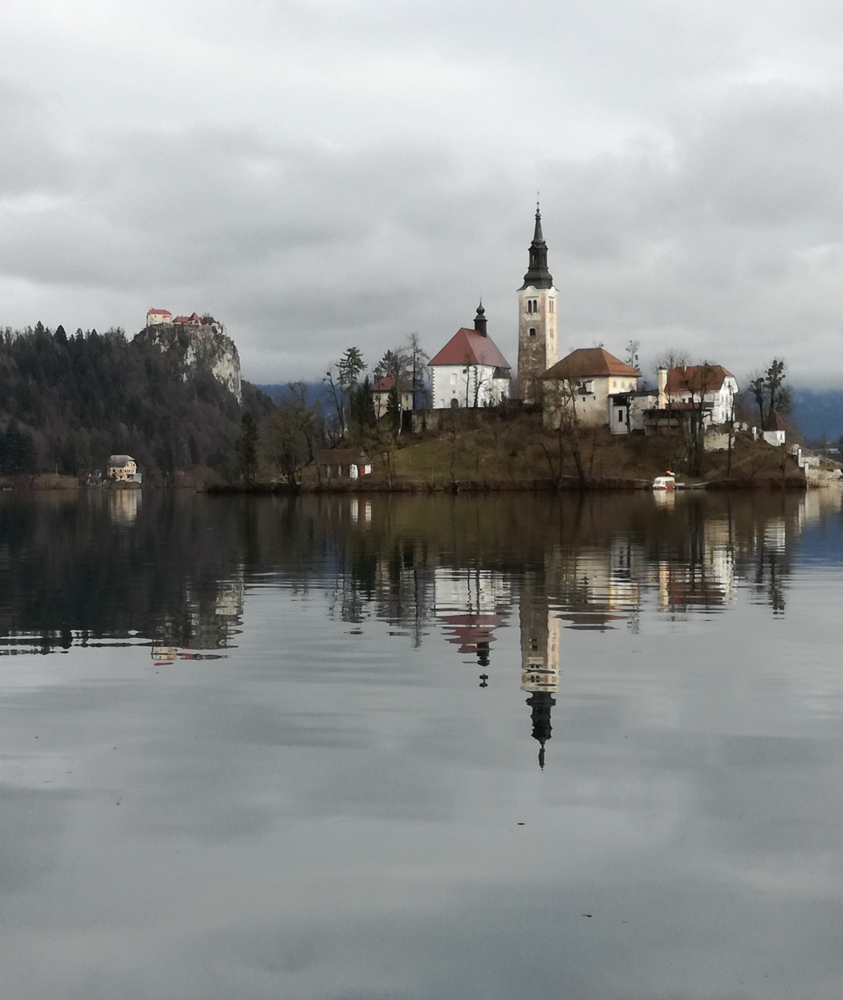
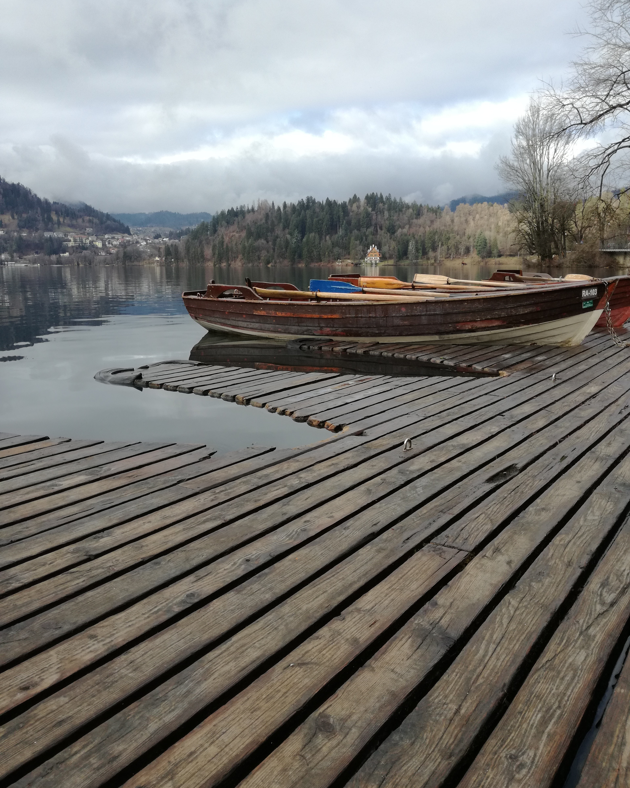

[Uploading index 1.html…]<!DOCTYPE HTML>
<html>
<head>
    <title>Una Ižaković - moj html dokument</title>
	    <link rel="stylesheet" href="stil.css"/>
</head>
<body class="pozadina">
    <h1>Digitalni multimediji</h1>
	<h2>O meni</h2>
	
Ja sam <b>Una Ižaković</b>, studentica sam prve godine dizajna grafičkih proizvoda na <i>Grafičkom fakultetu</i>. Imam dva psa i živim u <mark>Dugom Selu</mark>.
	   <q>Everything that is real was imagined first</q>
	

	
Ovo je drugi paragraf teksta! U njemu se nalazi blok citat:

	<blockquote>The future belongs to those 
	            who believe in the beauty 
				of their dreams.  
				-Eleanor Roosevelt
	</blockquote>
	
Završetak citata

	

	U nastavku slijedi
	

	
	<a href="https://fiume.info/una/"> link na moj portfolio</a> 
	<a href="vježba 1.html"> link na neki drugi dokument </a> 
	<a href="Dokumenti/Una Ižaković-Plavi jahač-seminarski rad.pdf"> ovo je link na pdf </a>
	

	<h2> LISTE !</h2>
	
moje najdraže životinje:

	<ol>
	  <li>slon</li>
	  <li>prerijski pas</li>
	  <li>bubamare</li>
	</ol>
    
destinacije za putovanja
	
	<ul>
	   <li>Francuska</li>
	   <li>Italija</li>
	   <li>Tajland</li>
	</ul>
	<h2>Navigacijska lista sa linkovima</h2>
	<nav> 
	    <ul>
		   <li><a href="#">prvi link</a></li>
		   <li><a href="#">drugi link</a></li>
		   <li><a href="vjezba 2.html">vjezba 2-multimedija</a></li>
		</ul>
	</nav>
	

</body>
</html>()

[Uploading novo 2.html<!DOCTYPE HTML>
<html>
<head>
    <title>vjezba 2</title>
	<link rel="stylesheet" href="stil.css"/>
	<body class="drugapozadina"> 
	<a href="index 1.html"> vrati me doma! </a>
	<h2>multimedija</h2>
	<h3>VIDEO</h3>
	<video width="400" height="#" controls> 
	    <source src="slike/mojvideo.mp4" type="video/mp4"/>
	</video>
	<h3>ZVUK</h3>
	<audio controls>
	       <source src="slike/wonders-of-the-ocean-160390.mp3" type="audio/mp3"/>
	</audio>
	</body>
</head>…]()

[Uploading vježba 1.h<!DOCTYPE HTML>
<html>
<head>
  <title>Vježba 1</title>
  <link rel="stylesheet" href="stil.css"/>
  <body class="pozadina">
     <a href="index 1.html"> vrati me doma! </a>
     <h1>slike</h1>
	 
	 
	 
	 
  </body>
</head>
    tml…]()

[Uploading@charset "utf-8"
p{
	color: green;
	font-family: Constania, "Lucida Bright", "DejaVu Serif", Georgia, "serif";
	font-size: 16px;
    line-height: 18px; 
    width: 600px;
    background-color: antiquewhite;
    padding: 20px;    	
}
paragraf_2 {color:darkcyan; background-color: rgba:(255, 255, 255, 0.9)}
novi_blok {
	background-color: rgba:(255, 255, 255, 0.5)
	padding:20px; 
	margin:20px;
	width:50%;
}
h1, h2 {
	font-family: Gotham, "Helvetica Neue", Helvetica, Arial, "sans-serif";
	color:cadetblue;
}

span{color: rgb:(255, 0, 255);}
pozadina{
	background-image: url(slike/Monet and Chicago _ The Art Institute of Chicago.jfif);
}

drugapozadina{
	background-color: darkgray
} 
a: link {
	color: black;
	background-color: white;
    padding: 5px;
    line-height: 40px;
    border:1px solid #000000; 		
}

a:hover {
	background-color: darkgray;
}
img {
	height: 200px; 
} stil.css…]()

[Uploading@charset "utf-8" novo 1.css…]()

https://github.com/unaizakovic/una_izakovic/assets/171672922/e26f37fb-ebe5-46c4-8101-7bfec21148d5

# una_izakovic
